<div align="center">


<br>

<a href="https://github.com/logsbymiii">

</a>

<a href="mailto:YOUR_EMAIL@gmail.com">

</a>

<a href="https://www.linkedin.com/">

</a>

<br><br>


</div>

---

<table>
<tr>

<td width="48%" valign="top">

## `01 / WHOAMI`

```text
┌──(helmi㉿polinema)-[~]

$ whoami

helmi@polinema

Business Information Systems student
Backend & Automation enthusiast
Exploring DevOps & Cloud Infrastructure

LOCATION    Malang, Indonesia
FOCUS       Systems / Automation / Infrastructure
MINDSET     Reliability over complexity

$ _
```

</td>

<td width="52%" valign="top">

## `02 / CURRENTLY`

### SYSTEMS

Building around real operational problems.

```text
01  REAL PROBLEM
        ↓
02  STRUCTURE
        ↓
03  AUTOMATION
        ↓
04  RELIABILITY
```

### INFRASTRUCTURE

```text
LINUX → DOCKER → CI/CD → CLOUD
```

Learning how systems move from:

`works locally`

to

`works reliably`

</td>

</tr>
</table>

---

## `03 / STACK`

<table>
<tr>

<td align="center" width="20%">

**LANGUAGES**


</td>

<td align="center" width="20%">

**BACKEND**


</td>

<td align="center" width="20%">

**DATABASE**


</td>

<td align="center" width="20%">

**DEVOPS**


</td>

<td align="center" width="20%">

**TOOLS**


</td>

</tr>
</table>

---

## `04 / SELECTED WORK`

<table>
<tr>

<td width="25%" valign="top">

### `01`

**AutoGampang.id**

`AI` `OCR` `TELEGRAM` `N8N`

AI-powered personal finance automation.

Turns receipt data into structured financial records with minimal manual entry.

</td>

<td width="25%" valign="top">

### `02`

**Herbigreen**

`LARAVEL` `N8N` `REPORTING`

Operational reporting automation.

Built around real workflows to replace repetitive manual reporting.

</td>

<td width="25%" valign="top">

### `03`

**Kamou Studio**

`LARAVEL` `PHP` `MYSQL`

Photography studio system.

Landing page and booking workflow for a real business use case.

</td>

<td width="25%" valign="top">

### `04`

**Experiments**

`API` `N8N` `BACKEND`

Small systems and automation experiments.

Build → test → break → learn → improve.

</td>

</tr>
</table>

---

## `05 / 2026 ROADMAP`

<div align="center">


</div>

<br>

<table>
<tr align="center">

<td width="20%">

**01**

### BACKEND

Server-side logic
System fundamentals

</td>

<td width="5%">→</td>

<td width="20%">

**02**

### AUTOMATION

Workflow design
Process optimization

</td>

<td width="5%">→</td>

<td width="20%">

**03**

### DEVOPS

Docker
CI/CD · Monitoring

</td>

<td width="5%">→</td>

<td width="20%">

**04**

### CLOUD

Infrastructure
Production systems

</td>

<td width="5%">→</td>

<td width="20%">

**05**

### ARCHITECTURE

System design
Scalable thinking

</td>

</tr>
</table>

---

<table>
<tr>

<td width="52%" valign="top">

## `06 / GITHUB ACTIVITY`

<div align="center">



<br>



</div>

</td>

<td width="48%" valign="top">

## `07 / CONTRIBUTION`

<div align="center">

<picture>

<source
media="(prefers-color-scheme: dark)"
srcset="https://raw.githubusercontent.com/logsbymiii/logsbymiii/output/github-contribution-grid-snake-dark.svg"/>

<source
media="(prefers-color-scheme: light)"
srcset="https://raw.githubusercontent.com/logsbymiii/logsbymiii/output/github-contribution-grid-snake.svg"/>


</picture>

<br><br>

<sub>contribution activity</sub>

</div>

</td>

</tr>
</table>

---

<table>
<tr>

<td width="42%" valign="top">

## `08 / APPROACH`

<div align="center">

```text
REMOVE
  ↓
FRICTION
  ↓
AUTOMATE
  ↓
RELIABLE
  ↓
SCALE
```

</div>

> I would rather ship something small that works reliably than something large that half-works.

</td>

<td width="58%" valign="top">

## `09 / DIRECTION`

<div align="center">

```text
BUSINESS SYSTEMS
        ↓
     BACKEND
        ↓
    AUTOMATION
        ↓
      DEVOPS
        ↓
      CLOUD
        ↓
  ARCHITECTURE
```

</div>

I'm not trying to collect technologies.

I'm trying to understand **how systems fit together.**

</td>

</tr>
</table>

---

<div align="center">


<br><br>

<sub>© 2026 Helmi Mohammad Fajari · Malang, Indonesia</sub>

<br><br>


</div>
